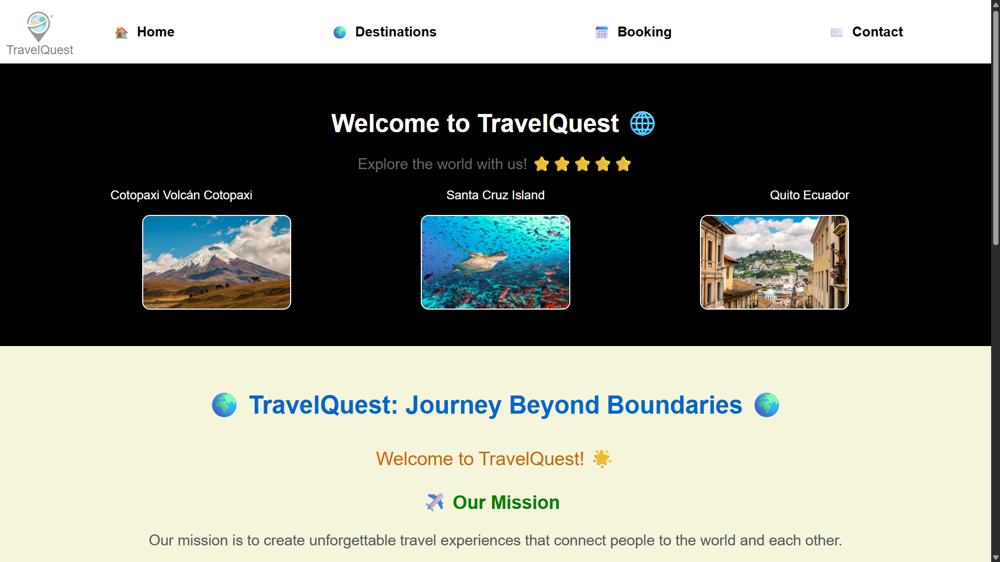
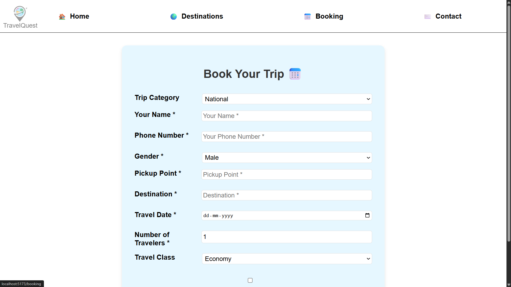

# 🌍 Travel Website (TravelQuest)

## 📌 Project Description

TravelQuest is a modern travel website developed using MERN stack technologies. It allows users to explore destinations, view travel packages, and book trips easily through a clean and responsive interface.

---

## 🚀 Features

* 🌎 Explore travel destinations
* 🧳 Booking system
* 📱 Fully responsive design (mobile-friendly)
* 🔗 API integration using mockAPI
* 📞 Contact page

---

## 🛠 Tech Stack

* **Frontend:** React.js (Vite)
* **Backend:** mockAPI (REST API)
* **Tools:** VS Code, Git, GitHub

---

## 📂 Project Structure

```
Travel-Website/
│── public/
│── src/
│── index.html
│── package.json
│── vite.config.js
│── docs/ (report & screenshots)
```

---

## ▶️ How to Run the Project

### 1. Clone the repository

```
git clone https://github.com/DIPAKJB/Travel-Website.git
```

### 2. Navigate to project folder

```
cd Travel-Website
```

### 3. Install dependencies

```
npm install -g vite
npm install --save-dev vite

```

### 4. Run the project

```
npm run dev
```

---

## 🔗 API Used

https://6795c0c4bedc5d43a6c36343.mockapi.io/Travel/Travel

---

## 📸 Screenshots

### 🏠 Home Page


### 🧳 Booking Page


### 🌍 Explore Page


---

## 📄 Project Report

[Download Internship Report](docs/Internship_Report.pdf)

---

## 👨‍💻 Author

**Dipak Baviskar**

---

## ⭐ Note

This project was developed as part of an internship using MERN stack technologies to build a responsive and user-friendly travel booking platform.
